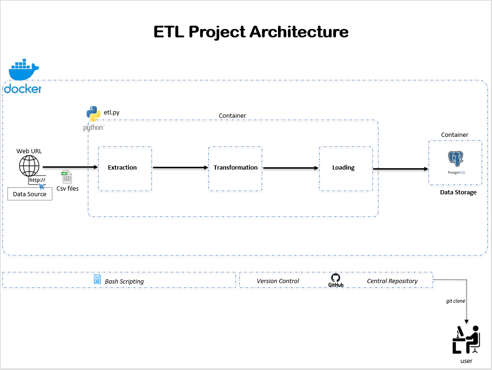

# Dockerized Python ETL with Postgres

This project demonstrates a simple ETL pipeline:
- Extract COVID-19 data from a public CSV.
- Transform column names.
- Load into a Postgres database.

## Overview

This project creates a virtual python environment (to avoid clashes with the versions on your local environment), activates the environment performs the ETL process by extracting data from a URL and loading it into Postgres.

It also creates a separate container for the Postgres and ETL pipeline respectively and uses a network to enable communication between both in docker.

## ETL Pipeline Architecture


---

## Prerequisite
- Have Docker Desktop Running
- Have a strong network connection to be able to pull the Postres Image.

## Steps to Run

1. Clone the repo:
- git clone [this repo](https://github.com/gBEN1-bit/cde_dockerized_pythonetl_and_postgres.git)
- cd cde_dockerized_pythonetl_and_postgres
- Configure Environment Variables
Assign values to the variables in the variables_to_export.sh file:
```bash
POSTGRES_USER=
POSTGRES_PASSWORD=
POSTGRES_DB=
POSTGRES_HOST=
DOCKERHUB_USERNAME=
```
- on your terminal run: source build_and_run.sh